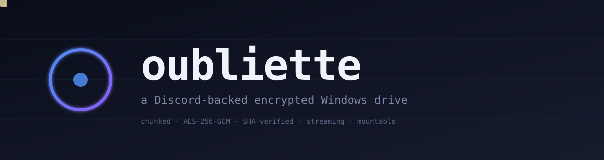
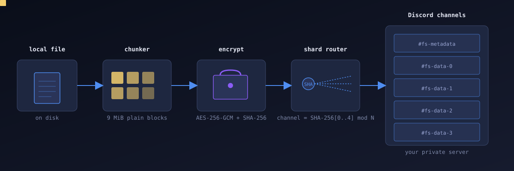
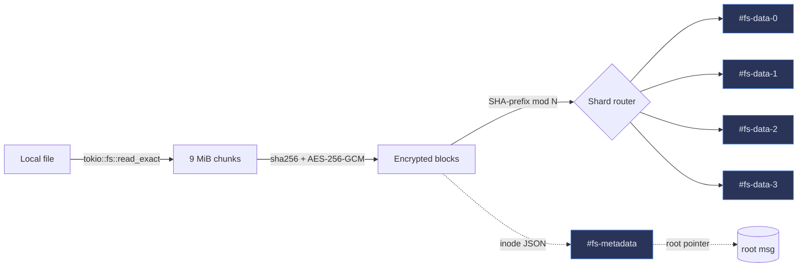
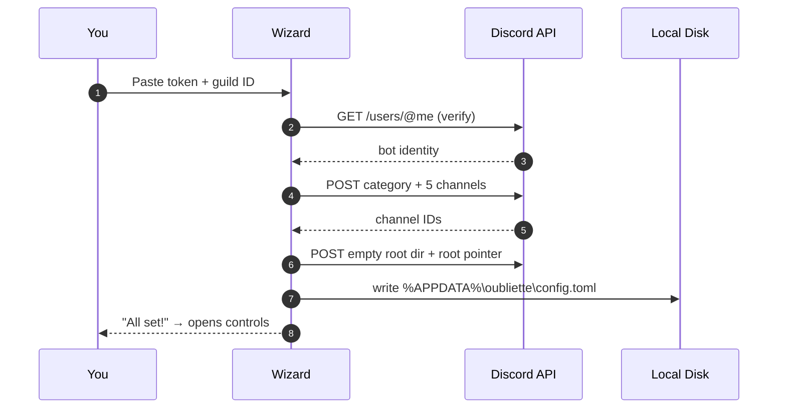
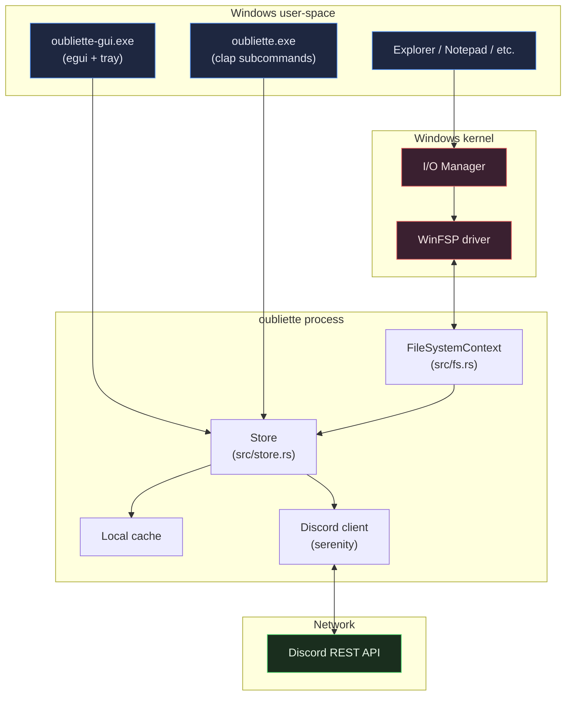
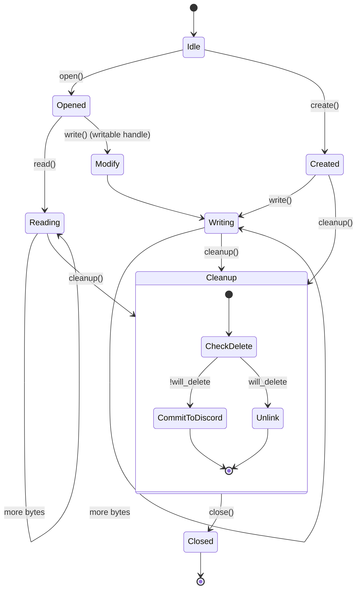
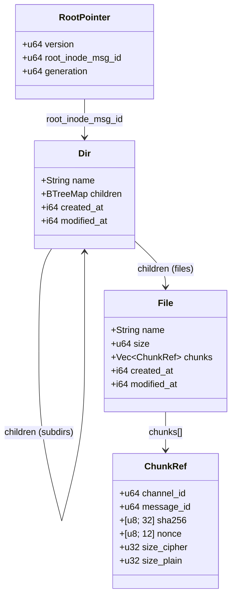
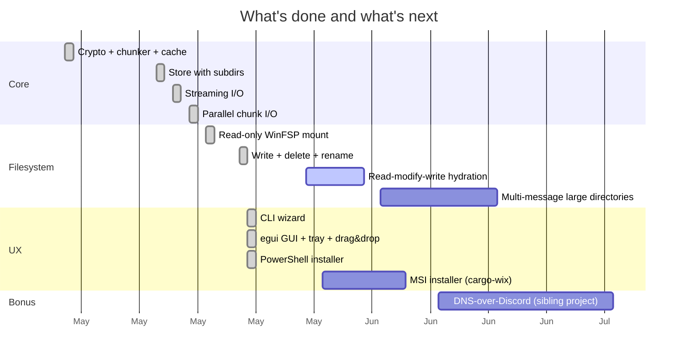

<div align="center">



[](LICENSE)
[](https://www.rust-lang.org/)
[]()
[]()

**A learning project that turns a Discord server into an encrypted Windows drive.**

</div>

---

> [!WARNING]
> ### Read this before you do anything
>
> **This project is for education and research only.** It exists to teach
> distributed storage, content-defined chunking, AES-GCM, FUSE/WinFSP, async
> runtimes, and end-to-end systems design — all in one place, in Rust.
>
> Using it for general file storage on Discord **almost certainly violates
> Discord's Terms of Service**. Use it only on a private server you own,
> with data you can afford to lose, and never deploy it at scale or
> commercially. If you want real cloud storage, use
> [restic](https://restic.net), [rclone](https://rclone.org),
> or [Backblaze B2](https://www.backblaze.com/cloud-storage).
>
> By using this software you accept all consequences. See [LICENSE](LICENSE).

---

## What this is

You mount a virtual drive — `Z:\` by default — on your Windows machine.
Files you copy into it get **chunked into 9 MiB blocks**, each block
**encrypted with AES-256-GCM** using a master key that never leaves your
machine, and **uploaded as ordinary message attachments** to a Discord
server you own. Files you copy out get reassembled, decrypted, and
SHA-256-verified on the fly.

Discord has no idea it's a filesystem. To Discord it just looks like a
chatty bot posting binary attachments.

<div align="center">



</div>

## At a glance — the pipeline



Reads run the same pipeline backwards, with **range-aware chunk fetches**:
if you seek to the 30% mark of a 1 GB file, the filesystem only downloads
the **one chunk** that covers that offset.

## Why this exists

Honestly? Because the constraints are interesting. Discord caps free
attachments at 10 MB. There's a global REST rate limit, per-channel
limits, message-edit semantics, attachment URLs that expire, no
transactions, no compare-and-swap. Building a real filesystem on top of
that — with integrity, encryption, streaming, parallelism, a real drive
letter — is a tour of distributed systems trade-offs in one project.

It's intentionally **ToS-adjacent**. That's part of the lesson. Real
systems are built against constraints set by people who don't owe you
anything.

## Quick start

> [!IMPORTANT]
> You need Windows 10 or 11, a [Discord account](https://discord.com),
> and ~5 minutes for the one-time setup.

### Path 1 — pre-built installer (recommended for trying it out)

1. Download the latest release from the GitHub releases page.
2. Unzip into a folder.
3. Double-click **`Install.bat`**. It will:
   - Detect or prompt you to install [WinFSP](https://winfsp.dev)
     (the kernel driver that lets us claim a drive letter)
   - Copy the binaries to `%LOCALAPPDATA%\Oubliette`
   - Create a Start Menu shortcut
   - Generate an uninstaller
4. Launch from Start Menu → **Oubliette**. The wizard walks you through
   creating a Discord bot in about 2 minutes.

### Path 2 — building from source

```powershell
# Prereqs: Rust 1.88+, WinFSP installed (https://winfsp.dev)
git clone https://github.com/Nuu-maan/oubliette.git
cd oubliette
cargo build --release

# Run the GUI wizard
.\target\release\oubliette-gui.exe

# ...or the CLI wizard
.\target\release\oubliette.exe setup
```

### First run, end-to-end

| Step                                      | Time   | What happens                                                    |
| ----------------------------------------- | ------ | --------------------------------------------------------------- |
| Install WinFSP                            | ~30 s  | Kernel driver registers with Windows                            |
| Create Discord application + bot          | ~60 s  | One-time. The bot needs Manage Channels + a few message perms.  |
| Invite bot to a private server you own    | ~20 s  | OAuth URL → pick your server → Authorize                        |
| Paste token + server ID into the wizard   | ~10 s  | Wizard verifies with Discord then creates the storage channels  |
| Mount `Z:\`                               | ~3 s   | Drive appears in File Explorer. Drop files in, drag them out.   |



## Features

- ✅ **Full CRUD via a real Windows drive letter** — open, read, write,
  seek, copy, move, delete, rename, mkdir, rmdir. Notepad opens text
  files. Explorer previews thumbnails. Powershell `Get-Content` streams.
- ✅ **AES-256-GCM per chunk** with a 12-byte random nonce. Master key
  generated at init, stored only in your local config.
- ✅ **SHA-256 verified on every read.** If a chunk's hash doesn't match
  on decrypt, the read fails loudly rather than returning corrupt bytes.
- ✅ **Hash-sharded across channels** so no single channel becomes a
  hotspot. Channel index is `u32::from_be_bytes(sha[0..4]) % N`.
- ✅ **4-way parallel chunk uploads and downloads** via
  `futures::stream::buffer_unordered`. Bound by your network, not by us.
- ✅ **Streaming I/O** — files are read from disk one chunk at a time
  with `tokio::fs::File::seek + read_exact`. RAM stays bounded regardless
  of file size.
- ✅ **Local disk cache** that turns warm `get` operations into
  ~5× faster reads. File inodes and chunks (which are content-immutable
  in our design) are cached; mutable directory inodes are deliberately
  not cached.
- ✅ **Range-aware reads** — opening a 1 GB file and seeking to 30%
  only downloads the one chunk that covers that offset.
- ✅ **Nested directories** with `mkdir -p` semantics, file & dir
  rename across directories, depth-unlimited path resolution.
- ✅ **Interactive CLI setup wizard** (`oubliette setup`) and
  **egui GUI wizard** with system tray icon, hide-on-close, drag-and-drop
  upload, per-file progress bars, and a stats panel.
- ✅ **PowerShell installer** with Start Menu shortcuts and uninstaller.

## Architecture



### On-Discord data layout

```mermaid
flowchart TD
    subgraph Server["Your Discord server"]
        subgraph Meta["#fs-metadata"]
            RP["root pointer message<br/>(small JSON, edited on every write)"]
            RD["root directory inode<br/>(children = name → msg_id)"]
            FI1["file inode #1<br/>(name, size, chunks[])"]
            FI2["file inode #2"]
            DI1["sub-dir inode<br/>(children = ...)"]
        end
        subgraph Data["#fs-data-N (sharded)"]
            C1["chunk a1f2…<br/>(9 MiB ciphertext)"]
            C2["chunk b3c4…"]
            C3["chunk 7e21…"]
            C4["..."]
        end
    end

    RP -->|points to| RD
    RD -->|children| FI1
    RD -->|children| FI2
    RD -->|children| DI1
    FI1 -->|chunks[].message_id| C1
    FI1 -->|chunks[].message_id| C2
    FI2 -->|chunks[].message_id| C3
    DI1 -->|nested children| C4
```

### Filesystem operations as a state machine



## CLI reference

```
oubliette --help
```

| Command             | Purpose                                                       |
| ------------------- | ------------------------------------------------------------- |
| `setup`             | Friendly first-time wizard (recommended)                      |
| `init`              | Lower-level init: needs `--token` and `--guild-id` flags      |
| `mount Z:`          | Mount the oubliette as a Windows drive. Ctrl+C to unmount.    |
| `put <local> /name` | Upload one file (also works from inside `Z:\` via copy)        |
| `get /name <local>` | Download one file                                              |
| `ls /`              | List directory contents                                        |
| `mkdir /a/b/c`      | Create directory tree (mkdir -p semantics)                    |
| `info`              | Show config + cache stats                                      |

Example session:

```powershell
oubliette setup                       # one-time
oubliette mkdir /movies               # create a directory
oubliette put .\clip.mp4 /movies/clip.mp4
oubliette ls /movies                  # f clip.mp4
oubliette get /movies/clip.mp4 .\out.mp4
oubliette mount Z:                    # then copy files via Explorer
```

## How it actually works

### 1. Chunking

`src/chunker.rs` is intentionally boring: fixed-size 9 MiB blocks.
**Why fixed and not content-defined?** Discord's 10 MB cap forces our
target around 9 MiB. The standard CDC library (FastCDC) caps avg chunk
size at 4 MiB and max at 16 MiB — neither plays well with our window.
We accept the dedup loss in exchange for a chunker that fits in 12 lines.

```rust
pub fn plan(file_size: u64, target: u64) -> Vec<ChunkSpec> { /* … */ }
```

### 2. Encryption

`src/crypto.rs` uses `aes-gcm = "0.10"`:

- **Master key**: 32 random bytes generated at `init`, hex-encoded into
  `%APPDATA%\oubliette\config.toml`. Never sent over the network.
- **Per-chunk**: fresh 12-byte nonce (`rand::thread_rng().fill_bytes`),
  encrypted with `Aes256Gcm::encrypt`, output is `ciphertext || tag`.
- **Per-chunk hash**: SHA-256 of the **plaintext** (not the ciphertext)
  is stored in the inode. On read, we re-hash after decrypt and refuse
  to return mismatched bytes.

```rust
let nonce = fresh_nonce();
let ciphertext = Aes256Gcm::new(&key).encrypt(&nonce, plaintext)?;
let sha = sha256(plaintext);
```

### 3. Sharding

`src/store.rs::pick_data_channel`:

```rust
let idx = u32::from_be_bytes([sha[0], sha[1], sha[2], sha[3]]) as usize
        % data_channels.len();
```

A SHA-256 prefix gives ~uniform distribution. With 4 data channels you
get rate-limit headroom (Discord allows ~5 messages per 5 seconds per
channel, so 4 channels → ~4 chunks/sec sustained).

### 4. Inodes & the root pointer

All metadata lives in `#fs-metadata` as JSON, posted as message text
when small (≤1900 chars) and as an attached `inode.json` when large.

- **Root pointer** is a single message whose text is `{"version":1,
  "root_inode_msg_id":…}`. Updating the tree = editing this one message.
- **Each directory** is a message whose text holds
  `{"type":"dir","name":…,"children":{<name>: <msg_id>}}`. Children are
  edited in place — Discord allows a bot to edit its own messages
  forever, which is the load-bearing trick that makes this work without
  a database.
- **Each file inode** holds `{"type":"file","name":…,"size":…,"chunks":
  [{channel_id, message_id, sha256, nonce, …}, …]}`.



### 5. Mount: WinFSP <-> async Store

`src/fs.rs` implements WinFSP's synchronous `FileSystemContext` trait.
Each callback calls into our async `Store` via
`Arc<tokio::runtime::Runtime>::block_on`:

```rust
fn read(&self, ctx: &FileCtx, buf: &mut [u8], offset: u64) -> Result<u32> {
    let plain = self.runtime.block_on(async move {
        // download chunks intersecting [offset, offset + buf.len())
        // decrypt, hash-verify
    })?;
    /* copy into buf */
}
```

Mount runs on a dedicated worker thread with the WinFSP host. The GUI's
egui main thread polls a status mutex; the worker reads a single
`std::sync::mpsc::Receiver<()>` for the stop signal.

## Performance

| Workload                                | Throughput (observed) |
| --------------------------------------- | --------------------- |
| Upload (5 MB, 1 chunk)                  | ~600 KB/s            |
| Upload (50 MB, 6 chunks, 4-way parallel) | ~620 KB/s (network-bound on most home links) |
| Download (50 MB, 4-way parallel)         | ~1.9 MB/s             |
| Warm `ls /` (cache hit)                  | ~2× faster than cold  |
| Warm `get` (cache hit)                   | ~5× faster than cold  |
| `dir Z:\` cold (first time)              | ~4 s                  |
| `dir Z:\` warm                           | <2 s                  |

Upload throughput plateaus around your home upload bandwidth.
Discord's API isn't the bottleneck for most users.

## Limitations

> [!CAUTION]
> ### Things you should know before relying on it
>
> - **Root directory caps at ~50 entries.** Directories are stored as
>   a single editable message and the 2 000-char content limit caps how
>   many children fit. Multi-message directories are on the roadmap.
> - **Token lives in plaintext** in `%APPDATA%\oubliette\config.toml`.
>   Anyone with access to your user profile can read it. Rotate it if
>   shared.
> - **Discord ToS.** This is the big one. Don't use it for anything
>   you care about.
> - **No atomicity across crashes.** If the mount process is killed
>   mid-upload, chunks may be orphaned on Discord (no GC).
> - **No deduplication.** Identical chunks are uploaded twice — we
>   could content-address them, but didn't, for simplicity.
> - **Read-modify-write of existing files** doesn't pre-hydrate the
>   temp buffer from chunks. Notepad editing a file already in `Z:\`
>   will zero the unwritten regions on save. (Workaround: copy out,
>   edit, copy back in.)
> - **Windows-only.** FUSE on Linux would be ~100 lines via the `fuser`
>   crate, but that's a future project.
> - **No rate-limit backoff.** A burst that exceeds Discord's per-bot
>   global limit will surface a 429 and abort the operation.

## Roadmap



## Internals deep-dive (educational reading)

Beyond this README, there are dedicated documents under [`docs/`](docs/):

- [**`docs/ARCHITECTURE.md`**](docs/ARCHITECTURE.md) — how the
  user-space process, WinFSP kernel driver, async runtime, and Discord
  client fit together. Threading model, lock ordering, sync ↔ async
  bridging.
- [**`docs/INTERNALS.md`**](docs/INTERNALS.md) — chunking math, AES-GCM
  cipher choice, why we hash plaintext not ciphertext, the root-pointer
  CAS pattern (and how we *don't* do it yet), and notes on the various
  ToS-adjacent design decisions.

## Contributing

This is primarily an educational project, so **PRs that improve
clarity, tests, or documentation** are especially welcome. See
[CONTRIBUTING.md](CONTRIBUTING.md) for the style and review process.

Please **don't** open PRs that:
- Add code making it easier to use this at scale or commercially
- Remove the ToS / educational disclaimers
- Embed a public bot token

## Acknowledgments

- [WinFSP](https://winfsp.dev) by Bill Zissimopoulos — the kernel
  driver that does the heavy lifting. The whole project is possible
  because WinFSP exists.
- [winfsp-rs](https://github.com/SnowflakePowered/winfsp-rs) by
  @SnowflakePowered — clean Rust bindings to WinFSP.
- [serenity-rs](https://github.com/serenity-rs/serenity) — the Discord
  client library doing all the rate-limit and multipart heavy lifting.
- [egui](https://github.com/emilk/egui) by @emilk — the dependably
  drama-free immediate-mode GUI that powered the wizard.
- The various distributed-systems papers and blog posts that taught
  me why content-defined chunking, Merkle trees, and write-ahead
  logging are the way they are.

## License

[Educational Research License](LICENSE) — based on MIT, with explicit
non-commercial and educational-intent clauses. See the LICENSE file
for the full text.

---

<div align="center">

Built as a learning project, in Rust, for the love of weird software.

</div>
