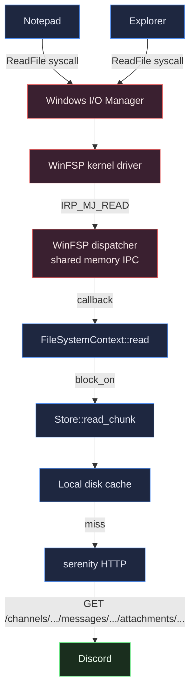
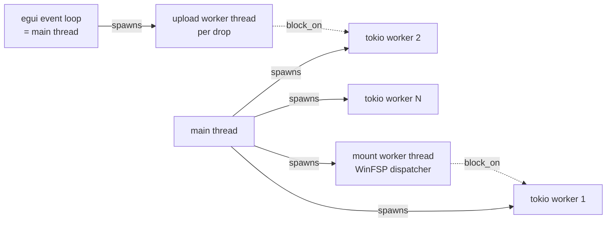
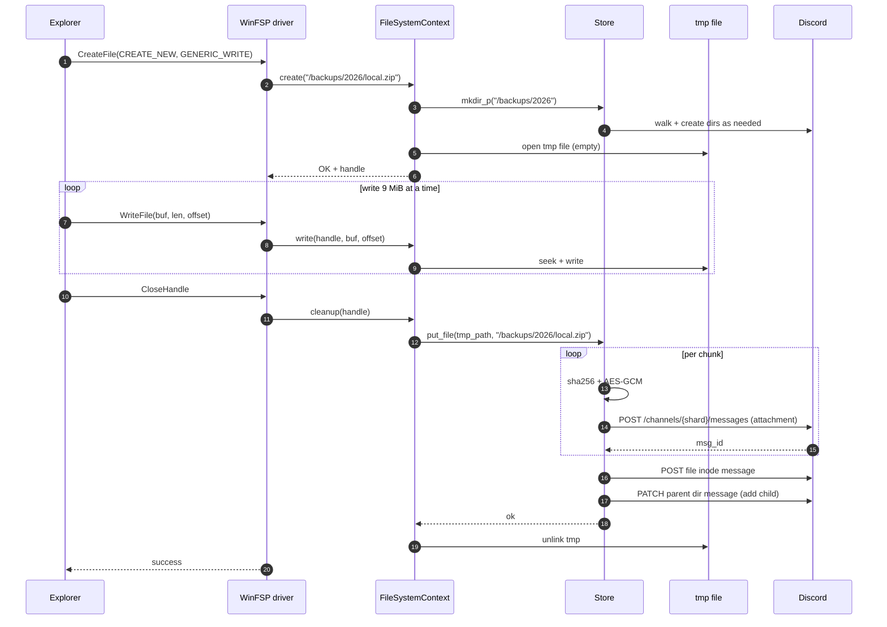

# Architecture

This document explains how the pieces fit together. It's deliberately
educational — if you're new to FUSE filesystems, async runtimes, or
distributed storage, you should be able to read this top-to-bottom and
come out the other side with a clear mental model.

## Bird's-eye view

There are three things running:

1. **Your code** (the `oubliette` process — CLI binary or GUI binary)
2. **The WinFSP kernel driver** (loaded when you install WinFSP, sits
   in the Windows storage stack and brokers I/O requests)
3. **Discord's infrastructure** (your bot makes REST calls to
   `discord.com/api/v10`)

When something in user-space (Notepad, Explorer, `Get-Content`) reads
or writes `Z:\foo.txt`, the request flows through the kernel,
into WinFSP, out to our process via WinFSP's `FspFileSystemDispatcher`,
through our `FileSystemContext` impl, through our `Store` (which
maintains the inode tree), through our `DiscordClient`, and finally
out to Discord's REST API.



## Module layout

| Module                | Role                                                         |
| --------------------- | ------------------------------------------------------------ |
| `src/error.rs`        | One `Error` enum with `thiserror::Error`. All `?`s land here. |
| `src/crypto.rs`       | AES-256-GCM helpers, SHA-256 helpers, fresh nonces.          |
| `src/chunker.rs`      | `plan(file_size, target) -> Vec<ChunkSpec>`. Boring on purpose. |
| `src/inode.rs`        | `Inode::File` / `Inode::Dir`, `ChunkRef`, `RootPointer`. Serde. |
| `src/config.rs`       | TOML config: token, channel IDs, master key, defaults.       |
| `src/discord.rs`      | Thin wrapper over `serenity::http::Http`. Upload, download, edit. |
| `src/cache.rs`        | Two file-based KV stores: inodes and chunks. Atomic via tmp+rename. |
| `src/store.rs`        | The high-level API. `init`, `put_file`, `get_file`, `list`, `mkdir_p`, `unlink`, `rename`, path resolution. |
| `src/cli.rs`          | `clap::Subcommand` enum for the CLI surface.                 |
| `src/main.rs`         | CLI entry. Builds the tokio runtime, dispatches subcommands. |
| `src/setup.rs`        | CLI wizard for non-tech users.                               |
| `src/fs.rs`           | WinFSP `FileSystemContext` impl.                             |
| `src/gui.rs`          | egui-based wizard + controls + tray icon.                    |
| `src/bin/gui_main.rs` | GUI binary entry. `windows_subsystem = "windows"` in release.|

## Threading & async model

The process has roughly four "kinds" of threads:



### Sync ↔ async bridging

WinFSP's callbacks are synchronous. Our `Store` is fully async (uses
`reqwest`, `tokio::fs`, etc.). We bridge them at exactly one place:

```rust
fn read(&self, ctx: &Self::FileContext, buf: &mut [u8], offset: u64)
    -> winfsp::Result<u32>
{
    let plain = self.runtime.block_on(async move {
        /* fetch and decrypt chunks */
    }).map_err(|_| STATUS_INVALID_DEVICE_REQUEST)?;
    /* ... */
}
```

`runtime.block_on(...)` is safe here because WinFSP dispatcher threads
are **not** tokio runtime threads — they're WinFSP-owned, so calling
`block_on` blocks them while the tokio scheduler runs the future on
its own thread pool.

If you try to `block_on` from *inside* a tokio task you'll get the
classic "Cannot start a runtime from within a runtime" panic. We
carefully don't.

### GUI ↔ background ops

Anything that hits the network from the GUI thread would freeze the
UI. So the egui main thread spawns `std::thread::spawn` workers that
call `runtime.block_on(...)` and stash results into
`Arc<Mutex<Option<Result>>>`. The egui update loop polls those mutexes
and drives `ctx.request_repaint_after(...)` until done.

Mount has its own worker thread that owns the WinFSP `FileSystemHost`
(which is `!Send`). It blocks on a `std::sync::mpsc::Receiver<()>` for
the stop signal.

## Storage layer

### Channel allocation

Init creates these channels in your guild, all inside a category named
`"oubliette"`:

| Channel       | Purpose                                                       |
| ------------- | ------------------------------------------------------------- |
| `#fs-metadata` | All inode JSON. Root pointer. Both small (text) and large (attached). |
| `#fs-data-0`  | Encrypted chunks. Shard 0.                                    |
| `#fs-data-1`  | Shard 1.                                                      |
| `#fs-data-2`  | Shard 2.                                                      |
| `#fs-data-3`  | Shard 3.                                                      |

We use 4 data channels by default. With Discord's per-channel rate
limit of ~5 messages / 5 seconds, this gives ~4 chunks/sec sustained
upload throughput, which is what bounds us in practice (alongside
your network).

### Root-pointer pattern

This is the load-bearing idea that makes the whole thing work without
a transactional database:

1. There's exactly **one mutable message** in `#fs-metadata` whose
   content is the root pointer JSON: `{"version":1,"root_inode_msg_id":
   <msg_id_of_root_dir>}`.
2. Every `put_file` operation:
   - Posts new immutable chunk messages
   - Posts a new immutable file inode message
   - **Edits** the parent dir's message to add the new child
3. Reads always start by fetching the root pointer fresh, then walk
   from there.

Because Discord lets a bot edit its own messages forever, the parent
dir's `message_id` is stable across edits. We don't need a generation
counter on every node — we just need to refresh the root view at the
start of each operation.

### What we *don't* have

- No CAS on the root pointer. Two concurrent writers will lose data
  for the loser.
- No multi-step transactions. A crash mid-`put_file` leaves orphaned
  chunks.
- No background garbage collection for orphaned chunks.

All three are "fine for a single-process learning project" decisions.

## Inode caching

Caching is correctness-tricky in a mutable filesystem. We sidestep
the problem by **only caching content-immutable inodes**:

- File inodes — written once, never edited again. **Cacheable.**
- Chunks — content-addressed via SHA-256. **Cacheable.**
- Directory inodes — edited in place on every child add/remove.
  **Never cached.**

This is enforced in `src/cache.rs::put_inode`:

```rust
pub fn put_inode(&self, msg_id: u64, inode: &Inode) -> Result<()> {
    if !matches!(inode, Inode::File { .. }) {
        return Ok(());  // silently skip dirs
    }
    /* write to disk */
}
```

The cache lookup is by Discord `message_id` (file inodes) or by SHA-256
hash (chunks). Both are durable.

## Path resolution

The classic Unix tree walk, adapted:

```rust
async fn resolve_path(&self, path: &str) -> Result<u64> {
    let parts = parse_path(path)?;
    let root_ptr = self.load_root().await?;
    let mut current = root_ptr.root_inode_msg_id;
    for part in &parts {
        let inode = self.read_inode(current).await?;
        let children = match inode {
            Inode::Dir { children, .. } => children,
            _ => return Err(Error::Other(...)),
        };
        current = *children.get(part).ok_or(...)?;
    }
    Ok(current)
}
```

Walks one inode message per path component. With the cache on warm
ops it's near-instant. Cold, each component is a single Discord
`GET /channels/{}/messages/{}`.

## Lifecycle of a write

Let's trace `Copy-Item local.zip Z:\backups\2026\local.zip` end-to-end:



Three roundtrips' worth of Discord calls per file, plus N chunk
uploads. The wins are: bytes never leave your process unencrypted
on the wire, and the temp file means we can chunk + parallelize
the upload while still showing Explorer a sequential writer.

## Failure modes and how we react

| Failure                              | Symptom                              | Mitigation                                                          |
| ------------------------------------ | ------------------------------------ | ------------------------------------------------------------------- |
| Discord 401 (bad/expired token)      | All ops fail with `Unauthorized`     | Run `oubliette setup` again with a fresh token                      |
| Discord 429 (rate limit)             | Upload errors mid-batch              | None currently — serenity has internal retry; we surface failures   |
| Network drop mid-upload              | Partial chunks on Discord, no inode  | Re-run the upload; old chunks orphan                                |
| Mount process killed (taskkill)      | Drive disappears, temp files leak    | WinFSP cleans up the kernel registration; we leave temp files       |
| Master key lost                      | All data on Discord is unrecoverable | Don't lose your config. (Future: print recovery phrase at init.)    |
| Discord deletes our channels         | All data unrecoverable               | This is a Discord-can-rug-you-anytime situation. Don't rely on this.|

## Why this design

A few decisions worth explaining because they aren't obvious:

- **Why store metadata on Discord too?** Because then the only state
  on your local machine is `config.toml` (token + master key + channel
  IDs). You can re-init a fresh machine from just the config file and
  recover everything.
- **Why not a SQLite local index?** Because then there's two sources
  of truth and they can drift. Discord is the source of truth; the
  cache is purely an optimization.
- **Why a single mutable root-pointer message?** Because Discord
  doesn't give us atomicity primitives, so we keep mutability to one
  place and live with the consequences. A real production version
  would use a CAS pattern with a version field and retry on conflict.
- **Why 4 data channels?** Empirically, more channels = better
  per-channel rate budget, but Discord doesn't love unbounded channel
  creation. 4 is the sweet spot for a personal install.
- **Why egui and not Tauri?** Tauri is wonderful but heavy (Webview2 +
  Node toolchain). egui ships a 22 MB self-contained `.exe` with no
  runtime dependencies. For an educational project that's a better
  trade.

If you want to dig further into specific choices (e.g. cipher choice,
chunking math, why no content-defined chunking), see
[INTERNALS.md](INTERNALS.md).
